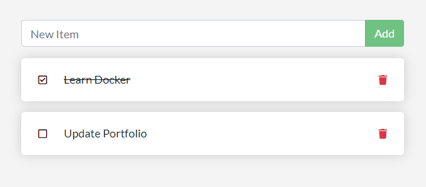

  # Docker To Do List
  
  This practice application uses Docker to package a full stack To Do List that uses SQLite.
  
  ## Table of Contents
  
  * [Installation](#installation)
  * [Built With](#built)
  * [Usage Information](#usage)
  * [Authors & Acknowledgements](#credits)
  * [Contact](#questions)  
  
  ## Installation 
  After cloning the repository, use the command "docker compose up --build" to build and run the application. The application can be accessed locally at localhost:3000.
  
  ## Built With 
  * Docker
  * SQLite
  * Yaml

  ## Usage Information
  This is a practice application.
    
  
  ## Authors & Acknowledgements
  This is a practice application found on Docker's main website. 
  Made by [TOVTC](https://github.com/TOVTC).
  
  ## Questions?
  Contact repository author via [GitHub](https://github.com/TOVTC). 
